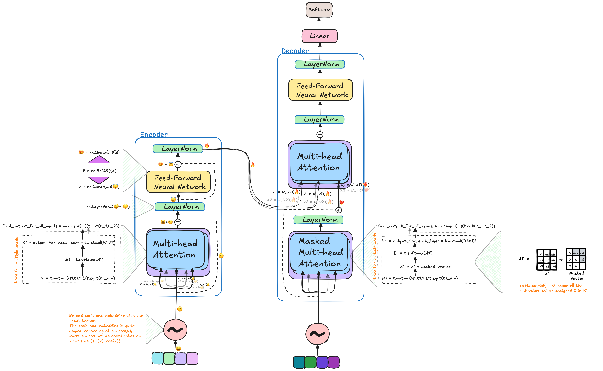

---
title: "Tansformer from Scratch"# date: 2015-08-14
permalink: /posts/2012/08/blog-post-4/
tags:

## Introduction

Recently Deep Learning has advanced rapidly using the introduction of Transformers, due to their ability to process data in parallel, 
compared to prior models which used to process data sequentially.
Hence, it becomes crucial for anyone to start understanding the Transformer model and how it works-looking to start contributing the in the domain of artificial intelligence or deep learning. 

## What is a Transformer?
The Transformer model is based on the Attention mechanism which is a mechanism that allows the model to focus on the relevant parts of the input sequence when predicting the output. The Transformer model has been used in various NLP tasks such as Machine Translation, Text Summarization, and Question Answering. In this blog post, we will be building a Transformer model from scratch.

## What is Attention?

## What is Self-Attention?

## What is Multi-Head Attention?

## What is Positional Embedding?

## What is Position-wise Feed-Forward Networks?

## What is Layer Normalization?

## What is Mased Multi-Head Attention?